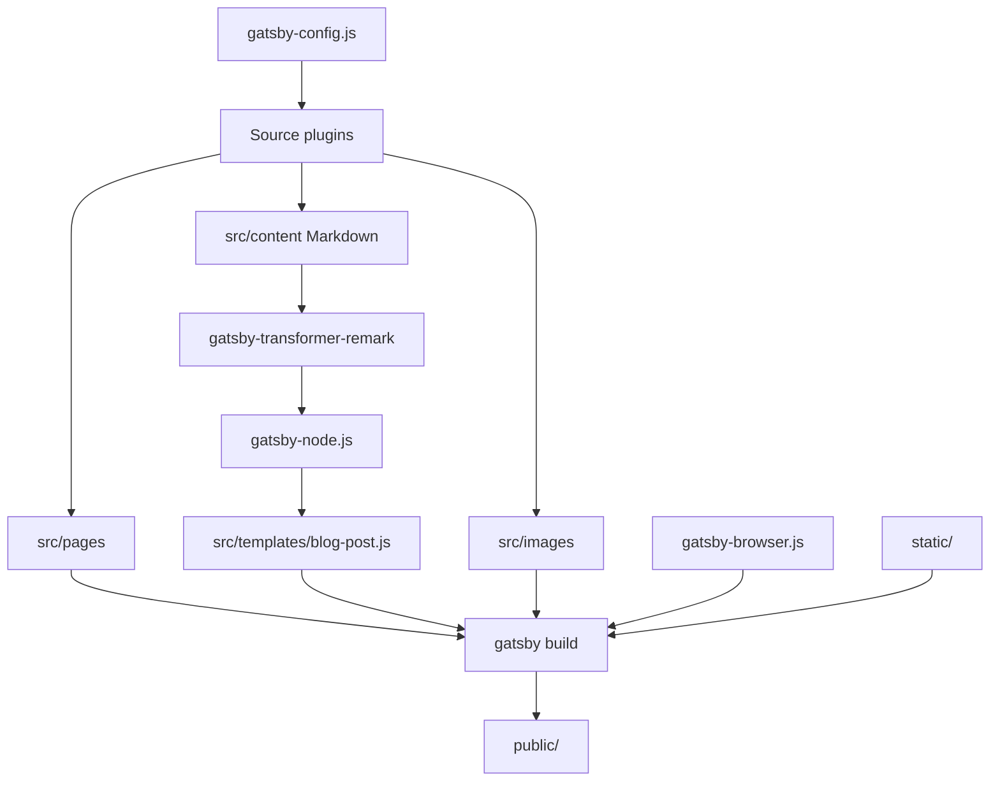
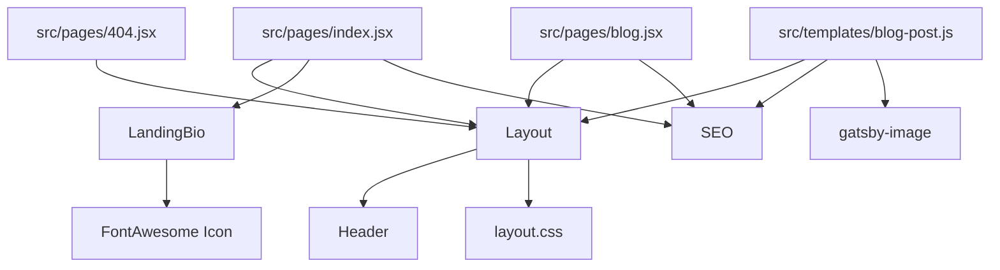
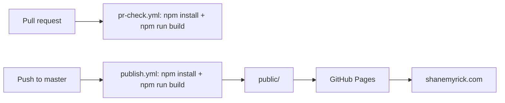

# Architecture

Last updated: 2026-06-01

This document describes the structure of `smyrick.github.io` for humans and AI agents working in the repository.

## Overview

This repository contains Shane Myrick's personal website and blog, published at <https://shanemyrick.com/>. It is a Gatsby static site that builds React pages, Markdown blog posts, images, metadata, and static assets into a deployable `public/` directory.

The site is intentionally small. Most changes should touch a page, a shared component, site metadata, or Markdown content.

## Project Type

- Type: Static personal website and blog.
- Framework: Gatsby 2.
- UI runtime: React 16.
- Styling: Emotion 10 plus global CSS in `src/components/layout.css`.
- Content: Markdown posts in `src/content/`.
- Node version: 14 from `.nvmrc`.
- Package manager: npm with `package-lock.json`.
- Deployment: GitHub Actions to GitHub Pages.

## Entry Points

### Build and Runtime Configuration

- `gatsby-config.js` configures site metadata, source directories, Markdown transformation, images, sitemap, manifest, offline support, syntax highlighting, and Emotion.
- `gatsby-node.js` adds Markdown slug fields and creates blog post pages from non-draft Markdown files.
- `gatsby-browser.js` imports PrismJS styles and loads the Nunito typeface on initial client render.

### User-Facing Pages

- `src/pages/index.jsx` renders the home page with `LandingBio`.
- `src/pages/blog.jsx` renders the blog index from `allMarkdownRemark`.
- `src/pages/404.jsx` renders the not-found page.
- `src/templates/blog-post.js` renders generated blog post pages.

### Commands

```bash
nvm use 14
npm install
npm start
npm run build
npm run serve
```

- `npm start` runs Gatsby's development server.
- `npm run build` creates the production build in `public/`.
- `npm run serve` serves the production build locally.

## Source Layout

| Path | Responsibility |
| --- | --- |
| `src/pages/` | File-based Gatsby pages. |
| `src/components/` | Shared layout, header, SEO, social icon, landing bio, and global CSS. |
| `src/templates/` | Templates used by Gatsby's page creation APIs. |
| `src/content/` | Markdown blog posts with frontmatter. |
| `src/images/` | Images processed by Gatsby image plugins. |
| `static/` | Static files copied directly into the build output. |
| `.github/workflows/` | PR build checks and GitHub Pages publishing. |

## Content Pipeline

Blog posts live in `src/content/` as Markdown. `gatsby-source-filesystem` loads them, `gatsby-transformer-remark` converts them to `MarkdownRemark` nodes, and `gatsby-node.js` creates a page for each non-draft post using `src/templates/blog-post.js`.

Expected frontmatter fields include:

- `path` - Public URL for the post.
- `title` - Post title.
- `date` - Post date, used for sorting and display.
- `draft` - Draft posts are excluded from generated pages.
- `featuredImage` - Image used by the blog post template.

## Component Model

- `Layout` wraps pages with `Header`, global CSS, content width, and footer.
- `Header` owns top-level navigation.
- `SEO` builds document metadata from page props and `siteMetadata`.
- `LandingBio` renders home page identity and social links from `siteMetadata.socialMedia`.
- `font-awesome-icon.js` registers Font Awesome icon libraries and renders social icons.

## Architecture Diagrams

### Build Flow



### Page and Component Relationships



### Deployment Flow



## External Interfaces

- Public website: <https://shanemyrick.com/>.
- GitHub Pages deployment target: generated `public/` output.
- Social links and site identity: `siteMetadata` in `gatsby-config.js`.
- Keybase verification: `static/keybase.txt`.

## Testing and Verification

There is no dedicated unit, integration, or end-to-end test suite. The primary verification path is:

```bash
npm run build
```

For visual changes, run:

```bash
npm start
```

or build and serve production output:

```bash
npm run build
npm run serve
```

## Deployment

GitHub Actions owns deployment:

- `.github/workflows/pr-check.yml` runs on pull requests and verifies `npm run build`.
- `.github/workflows/publish.yml` runs on pushes to `master`, builds the site, and publishes `public/` to GitHub Pages with CNAME `shanemyrick.com`.

## Maintenance Notes

- The stack is intentionally documented as-is: Gatsby 2, React 16, Node 14.
- Modernizing dependencies should be planned separately from content or design changes.
- Because this is a static site, source changes do not affect the live site until GitHub Actions rebuilds and publishes it.
- `public/` and `.cache/` are generated build artifacts and should not be committed.
