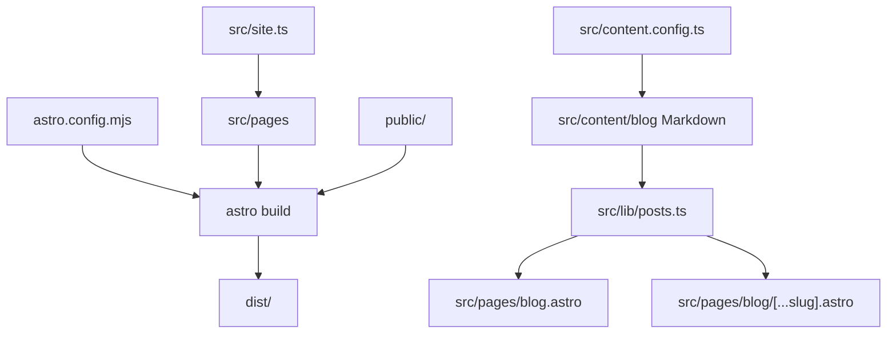
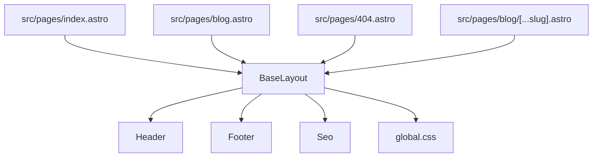
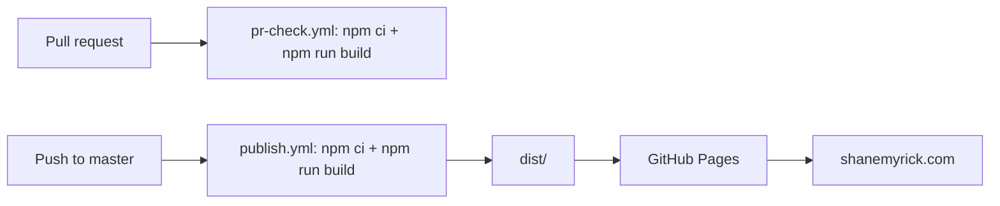

# Architecture

Last updated: 2026-06-01

This document describes the structure of `smyrick.github.io` for humans and AI agents working in the repository.

## Overview

This repository contains Shane Myrick's personal website and blog, published at <https://shanemyrick.com/>. It is an Astro static site that builds a warm personal landing page, Markdown blog posts, metadata, a sitemap, and static assets into a deployable `dist/` directory.

The site is intentionally small. Most changes should touch a page, a shared component, site metadata, global CSS, or Markdown content.

## Project Type

- Type: Static personal website and blog.
- Framework: Astro.
- Styling: Tailwind CSS plus global CSS in `src/styles/global.css`.
- Content: Markdown posts in `src/content/blog/`.
- Node version: 24 from `.nvmrc`.
- Package manager: npm 11.16.0 with `package-lock.json`.
- Deployment: GitHub Actions to GitHub Pages.

## Entry Points

### Build and Runtime Configuration

- `astro.config.mjs` configures the site URL, sitemap integration, and Tailwind Vite plugin.
- `src/content.config.ts` validates blog frontmatter.
- `src/site.ts` contains site identity, metadata, contact, and social links.

### User-Facing Pages

- `src/pages/index.astro` renders the home page.
- `src/pages/blog.astro` renders the blog index.
- `src/pages/blog/[...slug].astro` renders generated blog post pages from content collection entries.
- `src/pages/404.astro` renders the not-found page.

### Commands

```bash
nvm use 24
npm install -g npm@11.16.0
npm ci
npm start
npm run build
npm run serve
```

- `npm start` runs Astro's development server.
- `npm run build` creates the production build in `dist/`.
- `npm run serve` serves the production build locally.

## Source Layout

| Path | Responsibility |
| --- | --- |
| `src/pages/` | File-based Astro routes. |
| `src/components/` | Shared header, footer, and SEO components. |
| `src/layouts/` | Shared page layout and document shell. |
| `src/content/blog/` | Markdown blog posts with validated frontmatter. |
| `src/lib/` | Content helpers for published posts, slugs, descriptions, dates, and reading time. |
| `src/styles/` | Tailwind import and global site styles. |
| `public/` | Static files copied directly into the build output. |
| `.github/workflows/` | PR build checks and GitHub Pages publishing. |

## Content Pipeline

Blog posts live in `src/content/blog/` as Markdown. Astro content collections validate frontmatter through `src/content.config.ts`. `src/lib/posts.ts` filters out drafts and future-dated posts, sorts published posts, derives descriptions, and calculates reading time.

Expected frontmatter fields include:

- `path` - Public URL for the post.
- `title` - Post title.
- `description` - Optional SEO/listing description.
- `date` - Post date, used for sorting and display.
- `draft` - Draft posts are excluded from generated pages.
- `featuredImage` - Optional public image path used by the post page and social metadata.

## Component Model

- `BaseLayout` wraps pages with document metadata, old Gatsby service-worker cleanup, `Header`, and `Footer`.
- `Header` owns top-level navigation.
- `Footer` owns copyright and social links.
- `Seo` builds document metadata from page props and `src/site.ts`.

## Architecture Diagrams

### Build Flow



### Page and Component Relationships



### Deployment Flow



## External Interfaces

- Public website: <https://shanemyrick.com/>.
- GitHub Pages deployment target: generated `dist/` output.
- Custom domain: `public/CNAME`.
- Site identity and links: `src/site.ts`.
- Keybase verification: `public/keybase.txt`.

## Testing and Verification

There is no dedicated unit, integration, or end-to-end test suite. The primary verification path is:

```bash
npm run build
```

For visual changes, run:

```bash
npm start
```

or build and serve production output:

```bash
npm run build
npm run serve
```

## Deployment

GitHub Actions owns deployment:

- `.github/workflows/pr-check.yml` runs on pull requests and verifies `npm ci` plus `npm run build`.
- `.github/workflows/publish.yml` runs on pushes to `master`, builds the site, and publishes `dist/` to GitHub Pages.

## Maintenance Notes

- The site intentionally avoids a client-side framework.
- Old Gatsby PWA service workers are unregistered by `BaseLayout`.
- Because this is a static site, source changes do not affect the live site until GitHub Actions rebuilds and publishes it.
- `dist/` is generated and should not be committed.
